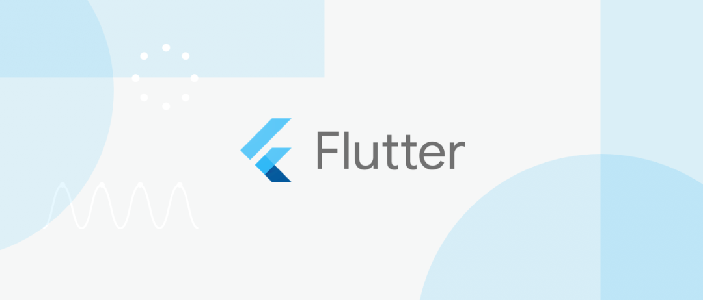

# 

### 啰嗦☺
> 这个仓库是我对最近学习Flutter的总结，难免会有不足或错误之处，如若大家有更好的理解还望能不瑟吝教，积极指出。
> 听说大部分人阅读文档或视频教程的最佳注意力在10-20分钟之间，所以对于较长的内容，我会分成多个篇幅。
> 随着学习的不断深入，我会慢慢完善这个仓库，希望对大家能有所帮助。✨

### 推荐教程
* [官网](https://flutter.dev/docs/get-started)
* [中文网](https://flutterchina.club)
* [插件搜索](https://pub.flutter-io.cn/)
* [视频教程](https://www.bilibili.com/video/BV1S4411E7LY?from=search&seid=3316132610922137116)
* [个人实战项目](https://github.com/haolizi/electricity_flutter)
...

### 总结目录
* [Fluro用法](fluro/FLURO1.md)
