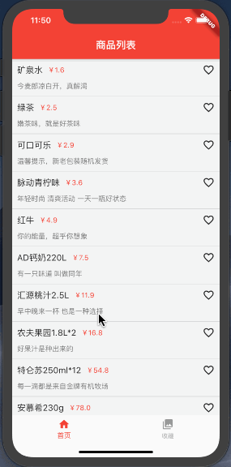

# Provider使用教程 
[](https://marketplace.visualstudio.com/items?itemName=provider.dart-code)

> 本文主要介绍Provider的简单使用，至于什么是Provider，为什么使用Provider，Provider底层如何实现？还请自行搜索。

### Demo效果
<div align="center">

### 前提须知
添加依赖：
```
dependencies:
  flutter:
    sdk: flutter

  provider: ^4.1.3
```

常用方法大概有以下几个，我会以Demo中商品添加购物车为例，逐个进行介绍。
```
MultiProvider                  管理多个共享数据类
ChangeNotifierProvider         监听到共享状态（数据）改变时重新构建Widget树
notifyListeners()              触发相关监听器
Provider.of<T>(context).value  获取数据
Consumer<T>                    通过指定模板参数，然后在内部自动调用ChangeNotifierProvider.of获取相应的数据，rebuild视图
Selector<A,S>                  针对某个值小范围rebuild视图
```

### ChangeNotifierProvider 
ChangeNotifierProvider用于向监听器发送通知，类似于Observable，当有值更改后，它将rebuild Consumer和Provider.of<T>(context)动态监听的地方。这里使用它对购物车数据进行监听，ChangeNotifierProvider有个create方法，给子widget提供数据。

### MultiProvider
用来管理多个共享数据，包裹根节点。

为了方便管理，我将MultiProvider包裹的ChangeNotifierProvider统一放在了main文件中。有人认为这样做，是不合理的架构，对于庞大产品来说会使项目更杂乱，所以要对需要用到的页面单独管理。嗯，怎么说呢，个人认为，在不影响产品性能的情况下，怎么舒服，怎么能快速开发就是合理的。

代码如下：
```
void main() {
  runApp(
    MultiProvider(
      providers: [
        // 用来管理BottomNavigationBar页面切换
        ChangeNotifierProvider(create: (context) => CurrentPageProvider()),   
        // 监听购物车数据
        ChangeNotifierProvider(create: (context) => CartProvider()),
        ...
      ],
      child: MyApp(),
    ),
  );
}
```

### notifyListeners
当有数据发生变化，需要通知页面更新时，调用notifyListeners()，所有和Consumer相关的方法都会被触发调用。如cart_provider文件中，购物车数据发生变化时：
```
class CartProvider with ChangeNotifier {
  List<CartInfoModel> cartList = []; // 收藏列表
  double allPrice = 0;
  collectGoods(CartInfoModel model) {
    if (cartList.contains(model)) {
      cartList.remove(model);
    } else {
      cartList.add(model);
    }

    allPrice = 0;
    cartList.forEach((value) {
      allPrice += value.price;
    });
    notifyListeners();
  }
}
```

### Provider.of
用来访问model中数据，比如我想获取购物车列表数据：
```
// listen默认会true，也能起到监听数据变化的作用，这里只需要获取数据，所以设为false
List<CartInfoModel> collectList = Provider.of<CartProvider>(context, listen: false).cartList;
```

### Consumer
当notifyListeners通知有数据变化时，所有和Consumer相关的方法都会被触发调用，然后rebuild其包裹的所有子孙widget，并重新赋值。不知大家是否看出一些问题，如果我们只需要更改某一条数据，而用Consumer包裹了所有widget，是不是平白耗费了大量性能。所以Consumer要尽可能的用在最内层的widget。

demo中有三处地方使用Consumer。
* 首页用Consumer来获取item的收藏状态，所以仅需要包在item外层。
```
class HomePage extends StatelessWidget {
  final List<CartInfoModel> list = [];
  @override
  Widget build(BuildContext context) {
    // 获取商品信息
    listData.cast().forEach((element) {
      list.add(CartInfoModel.fromJson(element));
    });
    return ListView.builder(
      itemCount: list.length,
      itemBuilder: (context, index) {
        return _itemWidget(context, list[index]);
      },
    );
  }
  
  // Consumer监听收藏状态，rebuild单个item
  Widget _itemWidget(BuildContext context, CartInfoModel model) {
    return Consumer<CartProvider>(builder: (context, child, value) {
      List<CartInfoModel> collectList =
          Provider.of<CartProvider>(context, listen: false).cartList;
      bool isCollect = collectList.contains(model);
      return ItemWidget(model: model, isCollect: isCollect);
    });
  }
}
```

* 购物车页面，因为购物车列表数据是动态变化的，所以需要包在最外层。
```
class CollectPage extends StatelessWidget {
  const CollectPage({Key key}) : super(key: key);

  @override
  Widget build(BuildContext context) {
    return Stack(
      children: <Widget>[
        // 购物车，使用Consumer监听数据变化，rebuild整个列表
        Consumer<CartProvider>(builder: (context, child, value) {
          List<CartInfoModel> collectList =
              Provider.of<CartProvider>(context, listen: false).cartList;
          return ListView.builder(
            itemCount: collectList.length,
            itemBuilder: (context, index) {
              return ItemWidget(model: collectList[index], isCollect: true);
            },
          );
        }),

        // 底部总价，selector监听总价变化，仅仅rebuild价格
        _bottomWidget(context),
      ],
    );
  }
  ...
}
```
* tabs页面中包在了最外层，因为要监听整个tabs的选中状态，同购物车页面，代码就不单独列出了。

### Selector
估计是考虑到Consumer的问题，Provider提供了Selector方法，它可以更精确的读取到某个数据的变化，比如购物车页面中商品总价的监听。
```
  ...
  Widget _bottomWidget(BuildContext context) {
    final screenWidth = MediaQuery.of(context).size.width;
    return Positioned(
      bottom: 0,
      left: 0,
      // selector监听总价变化，仅仅rebuild价格
      child: Selector<CartProvider, double>(
        builder: (BuildContext context, double price, child) {
          return Container(
            width: screenWidth,
            height: 50,
            color: Colors.red,
            alignment: Alignment.center,
            child: Text(
              '总价：￥${price.toStringAsFixed(2)}',
              style: TextStyle(
                color: Colors.white,
                fontSize: 18,
              ),
            ),
          );
        },
        selector: (BuildContext context, CartProvider collectProvider) {
          return collectProvider.allPrice;
        },
      ),
    );
  }
}
```

常用的方法大概也就这几个，具体使用请下载demo细看。由于对Provider的理解还不够深入，所以总结的可能不够全面，如有大佬路过，还望能指点一二。
