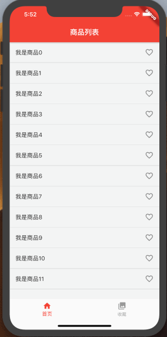

# Provider使用教程 
[](https://marketplace.visualstudio.com/items?itemName=provider.dart-code)

> 本文主要介绍Provider的使用，至于什么是Provider，为什么使用Provider，Provider底层如何实现？还请自行搜索。

### Demo效果


### 前提须知
常用方法大概有以下几个，我会以Demo为例，逐个介绍。
```
MultiProvider                            管理多个共享数据类
ChangeNotifierProvider             监听到共享状态（数据）改变时重新构建Widget树
notifyListeners()                       触发相关监听器
Provider.of<T>(context).value  获取数据
Consumer<T>                           通过指定模板参数，然后在内部自动调用ChangeNotifierProvider.of获取相应的数据，rebuild视图
Selector<A,S>                           针对某个值小范围rebuild视图
```
### ChangeNotifierProvider 